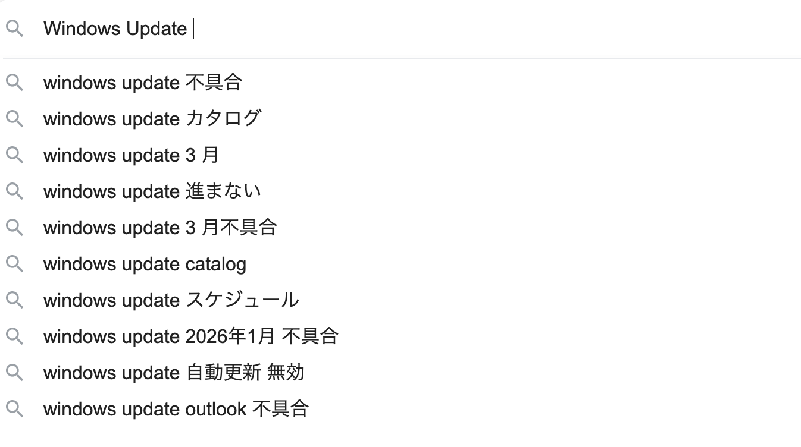

# 会津大学生のための思想の強い PC の選び方

## はじめに

初めましての方は初めまして。会津大学生をやっています、しゃけのきりみ。と申します。
この記事は、春から会津大学に入学され、PC 選びに悩んでいる新入生に向けた、**極めて個人的で思想の強い**PC の選び方ガイドです。

「生協 PC にするべきか」「Mac と Windows どちらが良いか」「メモリはどれくらい必要か」といったよくある疑問に対して、インターネットの海に漂う一般論ではなく、私が 2 年間会津大で過ごして感じた、偏った見解を記します。
あくまで個人の意見ですので、**エンタメ半分、参考半分**で読んでください。

## 結論から言うと

忙しい人のために、まずは私の結論を置いておきます。

**「Mac の US キーボードモデルを買え。」**

これが最強です。以上。
...で終わってしまうと流石に怒られそうなので、以下にそれぞれの項目について強い思想を展開していきます。

まず、会津大の新入生が最初にぶち当たる壁、「Mac か Windows どちらを買えばよいか」について。
結論から言うと、 **「Microsoft のいざこざに巻き込まれたくないなら Mac を買え。」**です。

## OS の宗教：Mac か、Windows か、それとも...

会津大生における OS のシェアは、体感ですが Mac と Windows が半々、時々 Linux、僅かに Windows が多いかなくらいです。
私の絶対的な推奨は**macOS（MacBook）**です。理由は以下の通り。

1. **ターミナルが人権**：Unix ベースであるため、プログラミングや後々触れることになる Linux 環境との親和性が抜群です。Windows は WSL2 こそ使えますが、やはりネイティブで Unix ベースの環境の方が安心です。
2. **ハードウェアの暴力**：トラックパッドの神がかった操作性、M チップによる異常なまでのバッテリー持ちと発熱の少なさ、Retina ディスプレイの美しさ。同じ価格帯の Windows ノートでこれに勝てる狂気のマシンはなかなかありません。特に、会津大学の教室はコンセントがほぼ無いに等しいにも関わらず PC を使わされるので、バッテリー持ちが非常に重要です。
3. **スタバでドヤれる**：重要ですね。ちなみに会津大学からスタバは自転車で 40 分くらいかかります。
4. **Windows がカス** : カスな理由は以下の画像が全て。
   

「授業で Windows が必要になったらどうするの？」と不安なあなた。大丈夫です、そんな事はありません。
そもそも会津大の授業は Unix ベースの環境をベースに作成されていて、大学の環境もほぼ全て Linux 環境です。
学部 2 年で「論理回路設計論」という授業がありますが、Windows こそ使うものの接続先は RHEL(Redhat Enterprize Linux)です。

※**「ThinkPad を買って自力で Linux (Arch,Gentoo,Ubuntu,NixOS など) を入れる」**という第 3 の道もありますが、それを選ぶような人間はこの記事を読んでいません。そのまま我が道を往ってください。

## メモリ（RAM）の思想：8GB は人権侵害

Apple 信者 が「Mac の 8GB は Windows の 16GB に相当する」などと供述していますが、**騙されてはいけません。**
特に、最近出た Macbook Neo は 8GB のメモリを搭載していますが、メイン機にするなら **絶対に選んではいけません。**  
VSCode、ブラウザの多数のタブなんかを動かし始めた日には、8GB は一瞬で食い潰されます。スワップ（ストレージをメモリ代わりにする機能）が発生して最悪 Mac の寿命を縮めます。

**絶対に最低 16GB**。予算が許すなら**24GB 以上**積んでください。
正直 16GB でも少し厳しいまであります。

## キーボードの思想：JIS 配列の呪いから逃れよ

日本の PC 市場は JIS 配列（日本語配列）が支配していますが、会津大学に入るなら**US 配列（英語配列）**を強く推奨します。

会津大学にあるキーボードは、全てが US キーボードです。パソコン甲子園などでは JIS をかろうじて用意しているようですが、会津大生が使うキーボードは例外無く US キーボードです。研究室などは知りませんが。
US キーボードと JIS キーボードの併用はできません。無理だと思ったほうがいい。併用しているひとはだいたい自分の PC を使って、演習室の PC を避けています。

## 最終的な推奨スペック

長々と書きましたが、私の推奨する具体的な構成（2026 年現在）はこちらです。

- **機種**: MacBook Pro または MacBook Air
- **メモリ**: 16GB または 24GB
- **ストレージ**: 512GB 以上 (1TB 以上が望ましい)
- **キーボード**: US 配列
